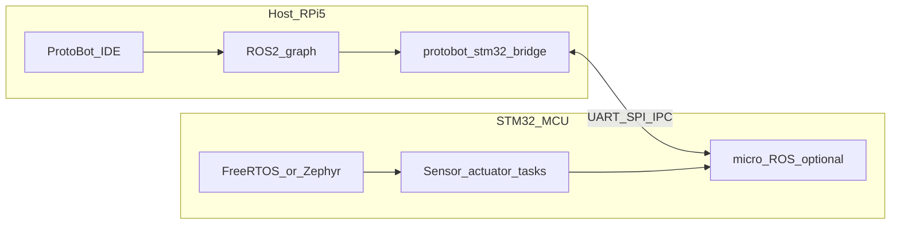

<!-- Cover: banner + badges + quick nav — keep paths relative for GitHub rendering -->
<p align="center">
  <picture>
    <source srcset="docs/assets/branding/readme-hero-banner.svg" type="image/svg+xml" />
    
  </picture>
</p>

<p align="center">
  <picture>
    <source srcset="docs/assets/branding/protobot-mark.svg" type="image/svg+xml" />
    
  </picture>
</p>

<p align="center">
  <a href="LICENSE.md"></a>
  <a href="https://docs.ros.org/en/jazzy/"></a>
  
</p>

<p align="center">
  
  
  
  
</p>

<p align="center">
  <a href="#why-protobot"><b>Overview</b></a> |
  <a href="#high-level-architecture"><b>Architecture</b></a> |
  <a href="#hardware-cad--pcb"><b>Hardware</b></a> |
  <a href="#repository-map"><b>Software stack</b></a> |
  <a href="#ros-2-workspace-ros2_ws"><b>Getting started</b></a> |
  <a href="#simulation-simulation"><b>Simulation</b></a> |
  <a href="#protobot-ide-ideprotobot-ide"><b>IDE</b></a> |
  <a href="#languages-docs-and-tooling"><b>Languages</b></a> |
  <a href="#contributing--license"><b>Contributing</b></a> |
  <a href="#authorship--commercial-rights"><b>License</b></a>
</p>

> **ProtoBot is a dual-compute robotics repository**: ROS 2 runs on Raspberry Pi 5 for high-level behavior, and STM32 handles deterministic sensing/actuation. The project is still in scaffold stage in several modules, but the structure is intended to keep SBC, MCU, simulation, IDE, and hardware artifacts evolving in the same codebase.

**ProtoBot** targets modular autonomous robotics with a practical split: high-level perception/navigation/HMI on the SBC, and real-time control on the MCU. Licensing is **CRCL-ProtoBot-v1** (commercial rights reserved; details in [LICENSE.md](LICENSE.md)).

Originally designed by Helmut Chaparro Sandoval — ProtoBot Project.

---

## Languages, docs, and tooling

| Area | Human language | Programming / config | Notes |
|------|----------------|----------------------|--------|
| **Repository docs** | **English** (default for `README`, `docs/`, `CONTRIBUTING`) | Markdown | Keeps issues, PRs, and search consistent for international collaborators. |
| **Legal** | **English** | `LICENSE`, `LICENSE.md` | CRCL-ProtoBot-v1 text is authoritative in English. |
| **ROS 2 packages** | English in `package.xml` descriptions | **C++** (rclcpp nodes), **Python 3** (launch files) | Messages in `protobot_msgs` use `.msg` / future `.srv` / `.action`. |
| **Build system** | — | **CMake**, **ament** | `colcon` orchestrates the workspace. |
| **Firmware** | English comments | **C11**, **CMake**, optional **arm-none-eabi-gcc** | FreeRTOS-oriented stubs; Zephyr path is phase 2 (`west`). |
| **ProtoBot IDE** | English UI strings | **TypeScript**, **Electron**, **Vite**, **CSS** (`design/tokens.css`) | Renderer imports shared design tokens from `/design`. |
| **Automation & CI** | English job names | **YAML** (GitHub Actions), **Dockerfile** | CI builds selected packages inside `ros:jazzy-ros-base`. |
| **Install helpers** | English comments | **Bash**, **PowerShell**, **POSIX shell** (`.command`) | Extend with distro-specific ROS bootstrap. |

Identifiers (package names, topics, branch names) stay **ASCII English** (`protobot_*`, `colcon`, …) to avoid toolchain encoding issues on embedded hosts.

---

## Table of contents

- [Languages, docs, and tooling](#languages-docs-and-tooling)
- [Why ProtoBot](#why-protobot)
- [High-level architecture](#high-level-architecture)
- [Hardware (CAD & PCB)](#hardware-cad--pcb)
- [Repository map](#repository-map)
- [ROS 2 workspace (`ros2_ws`)](#ros-2-workspace-ros2_ws)
- [Firmware (`firmware/`)](#firmware-firmware)
- [ProtoBot IDE (`ide/protobot-ide`)](#protobot-ide-ideprotobot-ide)
- [Design system (`design/`)](#design-system-design)
- [Simulation (`simulation/`)](#simulation-simulation)
- [Installers & Docker](#installers--docker)
- [Building & CI](#building--ci)
- [Contributing & license](#contributing--license)
- [Authorship & commercial rights](#authorship--commercial-rights)

---

## Why ProtoBot

Most robotics projects accumulate technical debt at subsystem boundaries (ROS graph, firmware, mechanical iterations, and tooling). ProtoBot is structured to reduce that friction by keeping interfaces, build flow, and hardware context in one place.

| Goal | How this repo supports it |
|------|---------------------------|
| **One repo for SBC + MCU integration** | ROS 2 packages and STM32 firmware stubs live together, so message definitions (`protobot_msgs`) and bridge contracts are versioned in the same place. This avoids silent drift between teams and makes interface changes auditable in PRs. |
| **Earlier integration feedback** | Launch files, heartbeat nodes, CI for core interfaces, and simulation placeholders provide fast signals when assumptions break. That is cheaper than discovering incompatibilities during hardware bring-up. |
| **Onboarding with a clear path** | New contributors can run a predictable flow (`colcon` workspace, bringup package, heartbeat binaries) without understanding all modules on day one. This lowers onboarding cost for students, interns, and new engineers. |
| **Growth without reorganizing the repo** | The layout already separates concerns (`ros2_ws`, `firmware`, `hardware`, `simulation`, `ide`). Teams can replace stubs with production implementations incrementally instead of migrating structure mid-project. |
| **Hardware is first-class context** | Mechanical CAD/3D and PCB folders are part of the same repository lifecycle. Software decisions and hardware revisions can be tracked together, which helps cross-discipline reviews and release planning. |
| **Clear legal and contribution boundaries** | The project states licensing and attribution rules from the start (**CRCL-ProtoBot-v1**), reducing ambiguity for collaborators and protecting commercial rights. See [LICENSE.md](LICENSE.md) and [LICENSE](LICENSE). |

### Current maturity snapshot

| Area | Status |
|------|--------|
| ROS 2 workspace structure and package scaffold | **Implemented** |
| Firmware folder structure and task placeholders | **Implemented (scaffold)** |
| ProtoBot IDE shell (Electron + TS) | **In progress** |
| Simulation assets | **Planned / placeholder** |
| Mechanical and PCB repository layout | **Implemented (scaffold)** |

---

## High-level architecture

Compute is split between a **Linux SBC** (ROS 2 graph, vision, AI, networking) and an **MCU** (deterministic control, power telemetry, optional micro-ROS agent). The IDE is the single entry point for day-to-day development on both sides.



**Reference ROS 2 distro:** **Jazzy** (aligned with Ubuntu 24.04 and long-term documentation quality). If you target **Humble**, audit each package’s dependencies and any distro-specific package names before building.

---

## Repository map

| Path | Purpose |
|------|---------|
| [design/](design/) | Visual identity: `tokens.json` / `tokens.css` for docs, badges, and the IDE. |
| [docs/](docs/) | Architecture notes, IDE design, license header templates. |
| [docs/ide/ARCHITECTURE.md](docs/ide/ARCHITECTURE.md) | ProtoBot IDE layering, STM32 profiles, ROS terminal strategy. |
| [hardware/](hardware/) | Physical product assets: mechanical CAD/3D and electronics (PCB) organized by maturity stage. |
| [ros2_ws/](ros2_ws/) | Colcon workspace; `protobot_*` packages and `protobot_msgs`. |
| [firmware/](firmware/) | STM32 (FreeRTOS-oriented CMake layout) and Zephyr (`west.yml`, phase 2). |
| [ide/protobot-ide/](ide/protobot-ide/) | Electron + Vite + TypeScript desktop shell. |
| [simulation/](simulation/) | Worlds and models for Gazebo / Webots (stubs). |
| [tools/install/](tools/install/) | Cross-platform install script stubs (`.sh`, `.ps1`, `.command`). |
| [docker/](docker/) | Dev-oriented container recipe (Jazzy base). |
| [.github/workflows/](.github/workflows/) | CI workflow (build selected packages in ROS container). |

---

## Hardware (CAD & PCB)

Hardware artifacts are now explicitly included in the repository under `hardware/`, separated by discipline and project maturity:

| Path | Purpose |
|------|---------|
| [hardware/mechanical/](hardware/mechanical/) | CAD and 3D assets (`.step`, `.stl`, native CAD files), enclosure concepts, and assembly iterations. |
| [hardware/mechanical/concept/](hardware/mechanical/concept/) | Early exploration models and dimensional studies. |
| [hardware/mechanical/prototypes/](hardware/mechanical/prototypes/) | Printable/machinable prototype iterations validated in lab. |
| [hardware/mechanical/production/](hardware/mechanical/production/) | Released mechanical baselines and manufacturing-ready revisions. |
| [hardware/pcb/](hardware/pcb/) | Electronics design sources (`.kicad_sch`, `.kicad_pcb`, BOM docs, fabrication outputs). |
| [hardware/pcb/concept/](hardware/pcb/concept/) | Block-level schematics and early board explorations. |
| [hardware/pcb/prototypes/](hardware/pcb/prototypes/) | Bring-up boards and pre-production electrical validation. |
| [hardware/pcb/production/](hardware/pcb/production/) | Released PCB revisions for manufacturing and assembly. |

Store generated fabrication artifacts in dedicated release bundles, and keep source design files versioned per board/mechanical module.

---

## ROS 2 workspace (`ros2_ws`)

The workspace follows the standard **`src/`** layout for `colcon`.

**Included packages (scaffold):**

| Package | Role |
|---------|------|
| `protobot_msgs` | Shared `.msg` types (battery, module descriptor, MCU telemetry frame). |
| `protobot_core` | Meta-package depending on the other `protobot_*` packages. |
| `protobot_description` | URDF/Xacro and a minimal `robot_state_publisher` launch. |
| `protobot_bringup` | Example stack launch + default YAML parameters. |
| `protobot_hmi`, `protobot_audio`, `protobot_vision`, `protobot_navigation`, `protobot_power`, `protobot_modular`, `protobot_stm32_bridge`, `protobot_ai`, `protobot_diagnostics` | C++ heartbeat nodes as placeholders for future functionality. |

**Build (Linux, Jazzy installed):**

```bash
cd ros2_ws
source /opt/ros/jazzy/setup.bash
colcon build --symlink-install
source install/setup.bash
ros2 launch protobot_bringup protobot_stack.launch.py
```

**Run a single heartbeat (example):**

```bash
ros2 run protobot_hmi hmi_heartbeat
```

---

## Firmware (`firmware/`)

| Path | Contents |
|------|----------|
| [firmware/stm32/](firmware/stm32/) | CMake entrypoint, `Core/` with named RTOS-oriented task stubs (`task_power_mgmt`, `task_sensor_fusion`, …), and folders reserved for HAL/Drivers. |
| [firmware/zephyr/](firmware/zephyr/) | Minimal `west.yml` placeholder for a future Zephyr application. |

Toolchain, flashing, and micro-ROS wiring are documented in each folder’s `README.md`. Replace stubs with STM32Cube-generated HAL and your board’s linker script when you move from scaffold to product firmware.

---

## ProtoBot IDE (`ide/protobot-ide`)

Cross-platform **Electron + TypeScript** application:

- **ROS 2 side (planned slices):** workspace detection, `colcon` tasks, graph inspection — always alongside a **real host terminal** (`ros2`, `rviz2`, etc.).
- **STM32 side (planned slices):** CMake build, serial monitor, OpenOCD/GDB, optional Zephyr `west` profile, optional **micro-ROS** layer on top of the chosen RTOS.

**Local development:**

```bash
cd ide/protobot-ide
npm install
npm run build
npm run dev
```

`dev` runs Vite and Electron with `PROTOBOT_DEV=1` so the window loads the dev server URL. For production-like runs, build first and launch Electron against `dist/renderer/index.html` (see [ide/protobot-ide/README.md](ide/protobot-ide/README.md)).

Read the full design write-up in [docs/ide/ARCHITECTURE.md](docs/ide/ARCHITECTURE.md).

---

## Design system (`design/`)

- **`tokens.json`** — machine-readable palette, radii, spacing, and font stacks.
- **`tokens.css`** — CSS custom properties (`--pb-*`) imported by the IDE renderer for a consistent dark, high-contrast robotics UI.

Use the same tokens in screenshots, diagrams, and marketing materials so the repo and the IDE feel like one product.

---

## Simulation (`simulation/`)

Placeholder directories for **worlds** and **models**. ROS launches and robot description live under `ros2_ws/src/protobot_description` until simulation assets grow here.

---

## Installers & Docker

| Artifact | Description |
|----------|-------------|
| [tools/install/protobot-ros2-install.sh](tools/install/protobot-ros2-install.sh) | POSIX stub — extend with distro detection, ROS apt sources, and `colcon` setup. |
| [tools/install/protobot-ros2-install.ps1](tools/install/protobot-ros2-install.ps1) | Windows stub for native or hybrid setups. |
| [tools/install/protobot-ros2-install.command](tools/install/protobot-ros2-install.command) | macOS-friendly entrypoint stub. |
| [docker/Dockerfile](docker/Dockerfile) | `ros:jazzy-ros-base` image copying `ros2_ws/src` into `/ros2_ws` for reproducible builds. |

---

## Building & CI

GitHub Actions workflow [.github/workflows/ci.yml](.github/workflows/ci.yml) builds **`protobot_msgs`** inside a **Jazzy** container to keep the interface package continuously verifiable. Expand the matrix with more packages as dependencies stabilize.

---

## Contributing & license

Contributions must comply with **CRCL-ProtoBot-v1**: non-commercial use for third parties with full attribution; commercial use only for authorized holders. See [CONTRIBUTING.md](CONTRIBUTING.md), [LICENSE.md](LICENSE.md), and [docs/templates/license-header.txt](docs/templates/license-header.txt) for headers in new source files.

---

## Authorship & commercial rights

| Role | Party |
|------|--------|
| **Original author & lead designer** | Helmut Chaparro Sandoval |
| **Authorized commercial partner** | Devkit Electronics S.A.S. |

Required attribution string in derivatives (non-commercial):

> Originally designed by Helmut Chaparro Sandoval — ProtoBot Project.
